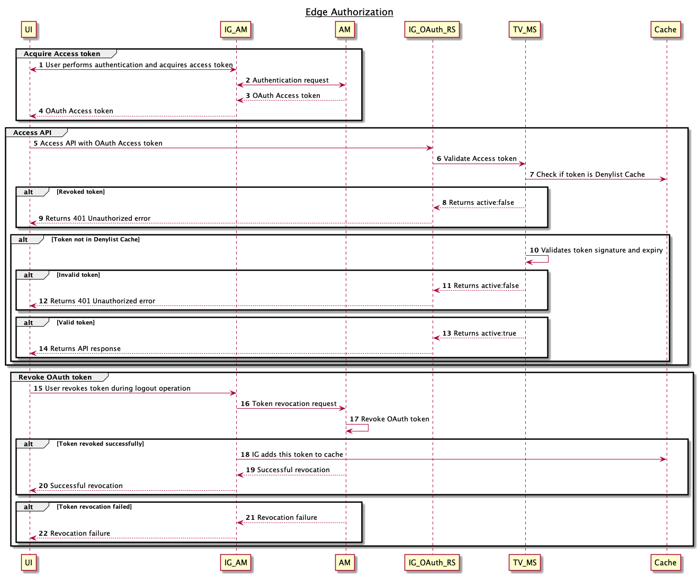

# EdgeAuthz-TokenValidation

Various IG Examples  

Disclaimer of Liability :
=========================
The sample code described herein is provided on an "as is" basis, without warranty of any kind, to the fullest extent
permitted by law. ForgeRock does not warrant or guarantee the individual success developers may have in implementing the
sample code on their development platforms or in production configurations.

ForgeRock does not warrant, guarantee or make any representations regarding the use, results of use, accuracy,
timeliness or completeness of any data or information relating to the sample code. ForgeRock disclaims all warranties,
expressed or implied, and in particular, disclaims all warranties of merchantability, and warranties related to the
code, or any service or software related thereto.

ForgeRock shall not be liable for any direct, indirect or consequential damages or costs of any type arising out of any
action taken by you or others related to the sample code.

Pre-requisites :
================
* Versions used for this project: IG 7.0.1, AM 7.0.0, IG-Microgateway 1.0.2, MicroserviceTokenValidation-1.0.2

1. Redis has been installed for shared caching service. This cache needs to be reachable from AM and MicroserviceTokenValidation
2. AM has been installed and configured. 

AM Configuration:
=====================
1. Create realm /customers and enable OAuth Provider
2. Create OAuth clients: microservice-client
3. Add microservice-A scope to this client
4. Enable appropriate grant types such as ROPC, refresh token etc 

IG Configuration:
=====================
1. Install IG
2. Leverage configs under /ig-am for this deployment
3. Start server: ig/bin/start.sh ~/forgerock/ig-am/

IG-Microgateway Configuration:
=====================
1. Install IG-Microgateway
2. Leverage configs under /micro-gateway for this deployment
3. Start server: mig1/bin/start.sh ~/forgerock/micro-gateway/
4. Deploy IG sample application as test backend application
5. For more details, refer https://backstage.forgerock.com/docs/mg/1/user-guide/#chap-using 

MicroserviceTokenValidation Configuration:
=====================
1. Install MicroserviceTokenValidation
2. Leverage configs under /token-validation for this deployment
3. Start server: tvms1/bin/start.sh ~/forgerock/token-validation/
4. For more details, refer https://backstage.forgerock.com/docs/mg/1/user-guide/#chap-using
   

Testing:
=========================
* Refer  for complete flow
* Refer postmanCollection/Edge Authz.postman_collection.json for postman collection:
   - Valid token flow 
   - Invalid token flow  

* * *

The contents of this file are subject to the terms of the Common Development and Distribution License (the License). You
may not use this file except in compliance with the License.

You can obtain a copy of the License at legal/CDDLv1.0.txt. See the License for the specific language governing
permission and limitations under the License.

When distributing Covered Software, include this CDDL Header Notice in each file and include the License file at
legal/CDDLv1.0.txt. If applicable, add the following below the CDDL Header, with the fields enclosed by brackets []
replaced by your own identifying information: "Portions copyright [year] [name of copyright owner]".

Copyright 2020 ForgeRock AS.

